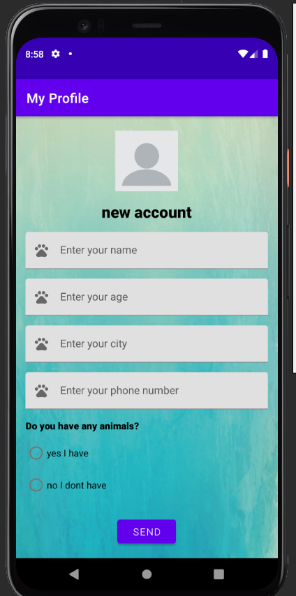

# README
---
## Cat babysitter app - java

> NOTE: ALL RIGHTS RESERVED to Shir Feldman & Michael Volfson 

A small project on a free babysitter on animals.

### Build - UP
- OOP
- Firebase
- Bootstrap

 

> NOTE: if one of the pictures are not working - all in pic folder

## ScreenShots - 
## **1. HOME PAGE**

  

## **2. Registration page**

  

## **3. Users**

  

## **4. Add details to the list**

  

## **5. Feedback page**

  

## **6. Last page**

  

---

